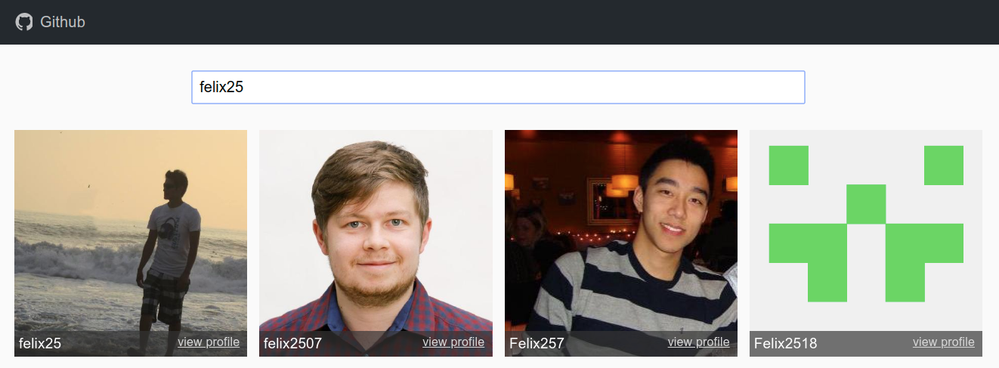

## react-github-users-repos

Api de github y reactjs.

### Features

- Busquedad de usuario
- Vista perfil y repositorio

## Available Scripts

En el directorio del proyecto, puede ejecutar

### `npm install`

### `npm start`

Ejecuta la aplicación en modo de desarrollo 
para verlo en el navegador [http://localhost:3000](http://localhost:3000) 
